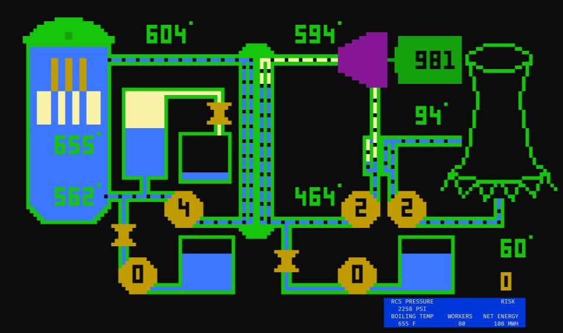

# SCRAM!

*Scram: A Nuclear Power Plant Simulation is an educational simulation video game developed for Atari 8-bit computers by Chris Crawford and published by Atari, Inc. in 1981. Written in Atari BASIC, Scram uses differential equations to simulate nuclear reactor behavior. The player controls the valves and switches of the reactor directly with the joystick.*

This is an attempt to reverse engineer the BASIC code in order to port it to other platforms. Current version runs uses ncurses and runs in a terminal.



# Requirements

```
sudo apt install libncurses-dev
```

# Building

```
make
```


# Running

```
./scram 2>/dev/null
```
Controls: arrow keys, pgup, pgdn.
